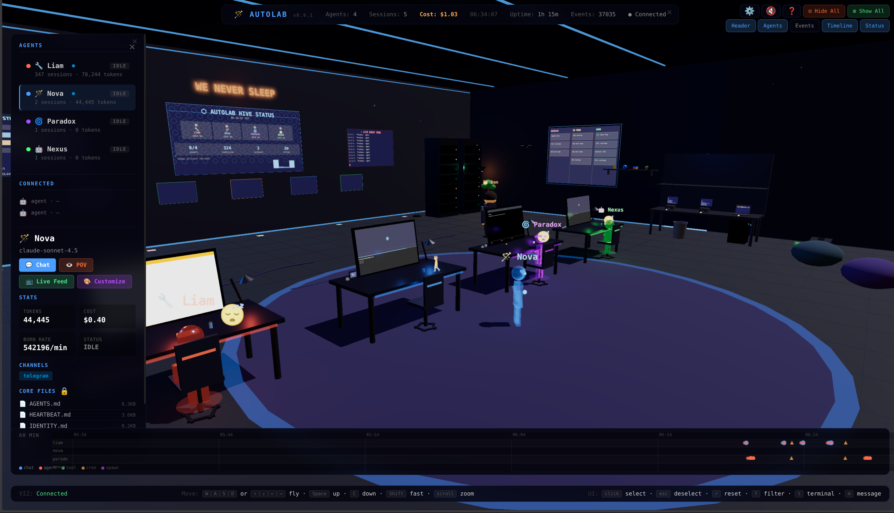

# AutoLab Virtual World (Public Release)

**A 3D virtual world visualization for AI agent orchestration**

Real-time 3D environment built with Three.js that visualizes AI agents, their activity, resource usage, and communications. Perfect for multi-agent systems running on [OpenClaw/AutoLab](https://github.com/autolab).



---

## Features

- **Live Agent Visualization** — See agents as 3D avatars with real-time status indicators
- **Activity Timeline** — Track agent actions, tool calls, and events over time
- **Resource Monitoring** — CPU, memory, token usage, burn rate per agent
- **Gateway Discovery** — Auto-discover AutoLab gateways on your network via mDNS
- **Session Management** — View active sessions, message history, and agent states
- **Interactive Kanban** — Drag-and-drop task board integrated into the 3D world
- **Camera Presets** — Predefined views: Overview, Agent Focus, Timeline, Kanban
- **WebSocket Live Updates** — Real-time sync with AutoLab gateway events
- **SSH Tunneling** — Secure remote access to gateways across machines

---

## Quick Start

### Prerequisites
- **Node.js** 18+ (for the web server)
- **AutoLab Gateway** running locally or on your network
- Modern browser (Chrome, Firefox, Edge, Safari)

### Installation

```bash
git clone https://github.com/YOUR_USERNAME/autolab-virtual-world-public.git
cd autolab-virtual-world-public
npm install
npm start
```

Open `http://localhost:3333` in your browser.

---

## Configuration

Copy `autolab-config.example.json` to `autolab-config.json` and edit:

```json
{
  "network": {
    "port": 3333,
    "gateways": [
      {
        "url": "ws://localhost:18789",
        "label": "Primary",
        "token": ""
      }
    ]
  },
  "overseer": {
    "name": "Admin",
    "displayName": "Overseer"
  }
}
```

For gateway token, see [AutoLab docs](https://docs.autolab.ai).

---

## Usage

### Camera Controls
- **Left-click + drag** — Rotate camera
- **Right-click + drag** — Pan camera
- **Scroll** — Zoom in/out
- **Keyboard shortcuts:**
  - `1-5` — Jump to camera presets
  - `ESC` — Reset camera
  - `K` — Toggle Kanban board
  - `T` — Toggle Timeline
  - `H` — Toggle help overlay

### Gateway Discovery
The system auto-discovers AutoLab gateways on your local network using mDNS.

Configure custom machines in `devices-config.json`:

```json
{
  "defaultUser": "overseer",
  "machines": [
    {
      "id": "machine1",
      "label": "Primary",
      "host": "192.168.1.10",
      "user": "user"
    }
  ]
}
```

---

## Architecture

- **Frontend:** Three.js + vanilla JS (no framework bloat)
- **Backend:** Express.js WebSocket server
- **Gateway Client:** Connects to AutoLab gateway via WebSocket
- **Discovery Service:** mDNS + SSH tunnel management for remote gateways

See [ARCHITECTURE-v0.6.md](ARCHITECTURE-v0.6.md) for full technical docs.

---

## Development

```bash
npm run dev    # Start with nodemon (auto-restart)
npm test       # Run tests (if any)
npm run lint   # ESLint check
```

### File Structure
```
/
├── server.js              # Main Express server
├── public/                # Frontend assets
│   ├── app.js            # Main 3D app logic
│   ├── modules/          # Scene components
│   └── assets/           # Textures, models, sounds
├── gateway-client.js     # AutoLab gateway connector
├── discovery.js          # Network discovery + tunneling
├── rpg-system.js         # XP/leveling for agents
└── docs/                 # Full documentation
```

---

## Deployment

### Docker (Recommended)

```bash
docker build -t autolab-virtual-world .
docker run -p 3333:3333 -v $(pwd)/autolab-config.json:/app/autolab-config.json autolab-virtual-world
```

### Production

```bash
npm run build   # (if build step exists)
NODE_ENV=production node server.js
```

Use a reverse proxy (nginx, Caddy) for HTTPS + domain mapping.

---

## Guides

- [QUICKSTART-v0.4.0.md](QUICKSTART-v0.4.0.md) — Step-by-step setup
- [CAMERA-GUIDE.md](CAMERA-GUIDE.md) — Camera presets & API
- [AUTOMATION-GUIDE.md](AUTOMATION-GUIDE.md) — Automate with OpenClaw CLI
- [DEPLOYMENT.md](DEPLOYMENT.md) — Production deployment tips

---

## Roadmap

- [x] Real-time agent visualization
- [x] Gateway discovery
- [x] Kanban board integration
- [x] Timeline view
- [x] SSH tunnel management
- [ ] Multi-room support
- [ ] Agent RPG leveling UI
- [ ] VR/AR mode
- [ ] Docker Compose one-click deploy
- [ ] Plugin system for custom visualizations

See [PROGRESS.md](PROGRESS.md) for full feature checklist.

---

## Contributing

Contributions welcome! Please:
1. Fork this repo
2. Create a feature branch
3. Commit your changes
4. Open a PR with description

---

## License

MIT License — see [LICENSE](LICENSE)

---

## Credits

Built with:
- [Three.js](https://threejs.org/) — 3D rendering
- [Express.js](https://expressjs.com/) — Web server
- [ws](https://github.com/websockets/ws) — WebSocket library
- [AutoLab/OpenClaw](https://github.com/autolab) — AI agent orchestration

Inspired by production AI ops dashboards and the need for better agent observability.

---

## Support

- **Issues:** [GitHub Issues](https://github.com/YOUR_USERNAME/autolab-virtual-world-public/issues)
- **Docs:** [docs/](docs/)
- **Community:** [Discord](https://discord.com/invite/clawd) (OpenClaw community)

---

**Built by the AutoLab community** 🤖🌐
